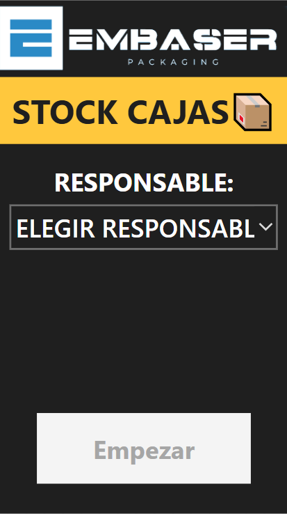
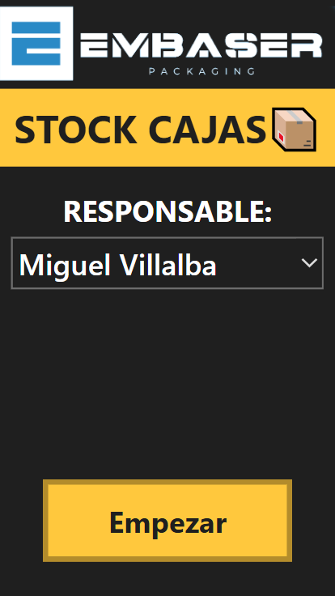
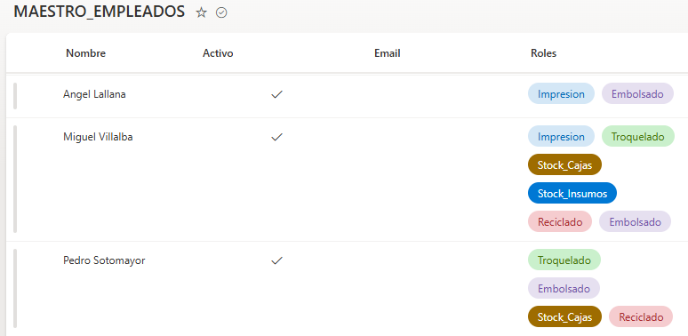
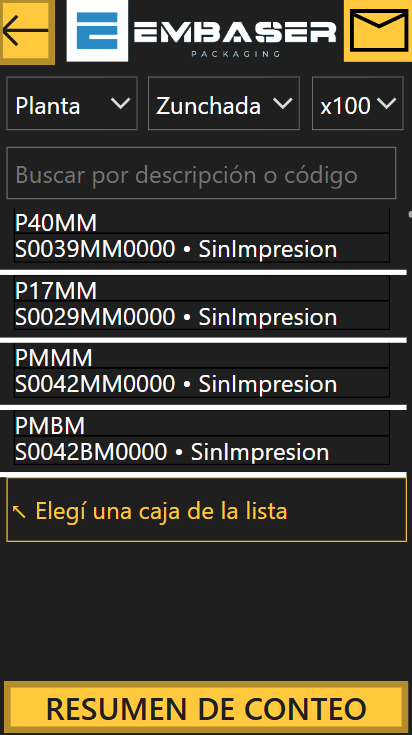
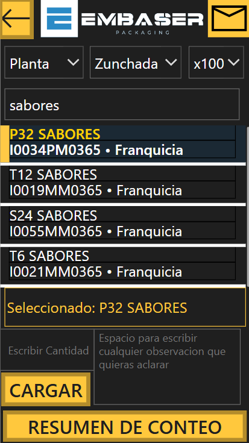
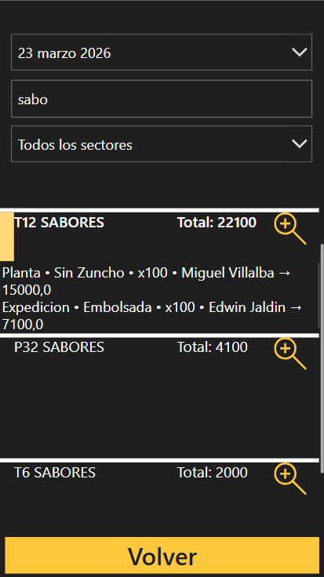
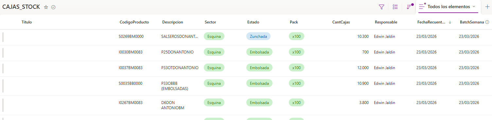
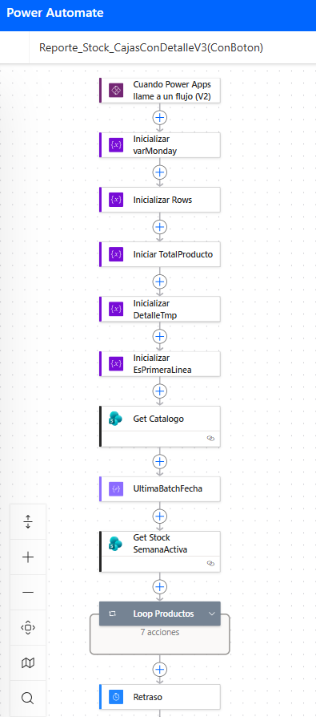
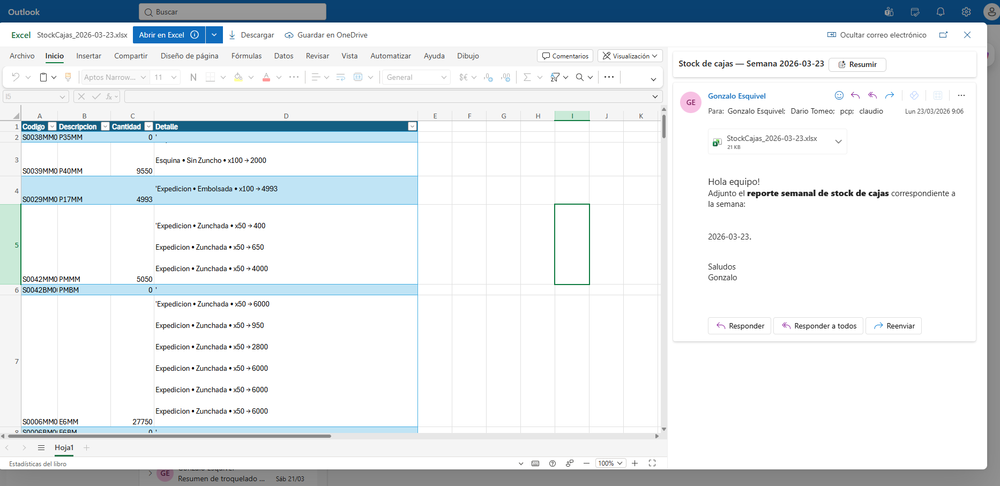

# Box Stock Management System | Power Apps + SharePoint + Power Automate

A stock counting and reporting solution designed for a packaging manufacturing environment.

This project digitized a manual paper-based stock process and turned it into a structured workflow with validation, traceability, centralized storage, and automated reporting.

## Overview

In the original process, stock counts were recorded manually on paper, making it difficult to:
- keep consistent records,
- identify who performed each count,
- consolidate weekly stock information,
- filter by sector, product or date,
- and quickly share results with production stakeholders.

To solve this, I built a Power Platform-based system composed of:

- **Power Apps** for stock counting and user interaction
- **SharePoint Lists** for employee master data and stock records
- **Power Automate** for automatic email reporting with Excel attachment

## Business context

This solution was created for a real manufacturing operation in the packaging industry, where stock visibility is important across different sectors and product conditions.

The app allows operators or responsible users to count box stock by:
- sector/location,
- product,
- packaging type,
- stock condition/state,
- quantity,
- and observations.

## Main features

### 1. Responsible user validation
The app does not allow the counting process to start until a responsible user is selected.

The responsible selector is connected to a SharePoint employee master list containing:
- employee name,
- active/inactive status,
- email,
- operational roles/skills.

Only active employees assigned to stock counting are shown.

### 2. Controlled counting workflow
Once the session starts, the user can define:
- where the count is being performed,
- product status,
- package size,
- responsible user.

This helps standardize how stock is recorded and improves traceability.

### 3. Product search and guided selection
Users can search products by:
- model,
- description,
- code,
- franchise/reference.

The app prevents quantity uploads unless a product has been selected first.

### 4. Input validation
After selecting a product, the app:
- highlights the selected item,
- displays the chosen model,
- enables quantity entry,
- allows optional observations,
- blocks submission if quantity is empty,
- restricts quantity input to numeric values.

This reduces common manual errors.

### 5. Weekly count summary
A summary view lets users review accumulated counts by week, with filters such as:
- date,
- sector,
- product/model,
- area.

Each item can be expanded to show detailed records including:
- sector,
- responsible user,
- quantity,
- total counted stock.

### 6. Centralized SharePoint storage
All stock movements are stored in a SharePoint list, allowing structured access to:
- product code,
- description,
- sector,
- state,
- package,
- quantity,
- responsible user,
- recount date,
- batch week.

### 7. Automated reporting by email
At the end of the stock process, the user can trigger an email report from the app.

A Power Automate flow:
- receives the request from Power Apps,
- processes the current stock data,
- generates an Excel report,
- names it automatically based on the counting week,
- and emails it to the relevant production stakeholders.

This gives near real-time visibility of stock levels without requiring manual report preparation.

## Process flow

1. User selects the responsible person  
2. App validates active/authorized employee  
3. User chooses sector, state and package type  
4. User searches and selects a product  
5. User enters quantity and optional observation  
6. Record is stored in SharePoint  
7. Weekly summary can be reviewed in-app  
8. Final report can be triggered by email  
9. Power Automate sends an Excel summary to stakeholders  

## Screenshots

### Responsible selection

### Responsible selected

### Employee master data in SharePoint

### Product search screen

### Count input and observations

### Weekly summary

### SharePoint stock list

### Email confirmation

### Power Automate flow

### Final email with Excel attachment

## Technical stack

- **Power Apps**
- **Power Automate**
- **SharePoint Lists**
- **Excel reporting**
- **Operational logic / data validation**
- **UI-focused workflow design**

## Data model

### SharePoint List: Employee Master
Example fields:
- Name
- Active
- Email
- Roles

### SharePoint List: Stock Records
Example fields:
- ProductCode
- Description
- Sector
- State
- Pack
- Quantity
- Responsible
- CountDate
- BatchWeek
- Observations

## Key improvements achieved

- Replaced manual paper-based stock counting
- Improved traceability of who counted each record
- Standardized data entry
- Reduced invalid or incomplete records
- Centralized stock information
- Enabled weekly operational visibility
- Automated stakeholder communication
- Reduced manual reporting effort

## Challenges solved

- Restricting workflow until a valid responsible user is selected
- Filtering employees based on active status and assigned roles
- Preventing invalid count submissions
- Structuring stock data for weekly analysis
- Automating report distribution without manual file preparation

## What I would improve next

- Add role-based permissions by sector
- Add dashboard analytics in Power BI
- Add barcode scanning for faster product selection
- Track stock adjustments and audit history
- Add low-stock alerts by product family

## Notes

This repository documents the functional design, workflow and architecture of the solution.  
Sensitive internal business data has been removed or anonymized.

## Author

**Gonzalo**  
Process digitalization and operational automation with Power Platform.
